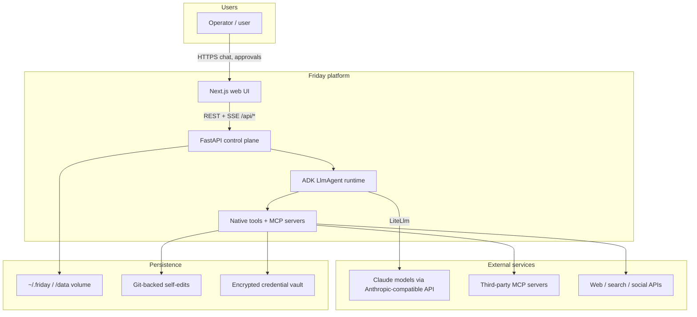
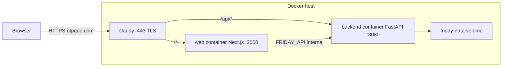
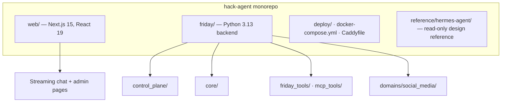
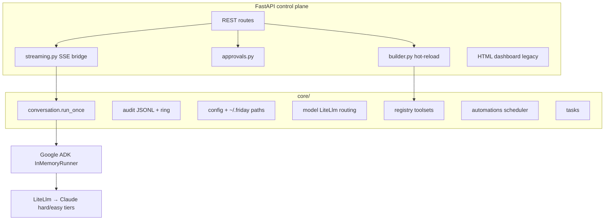
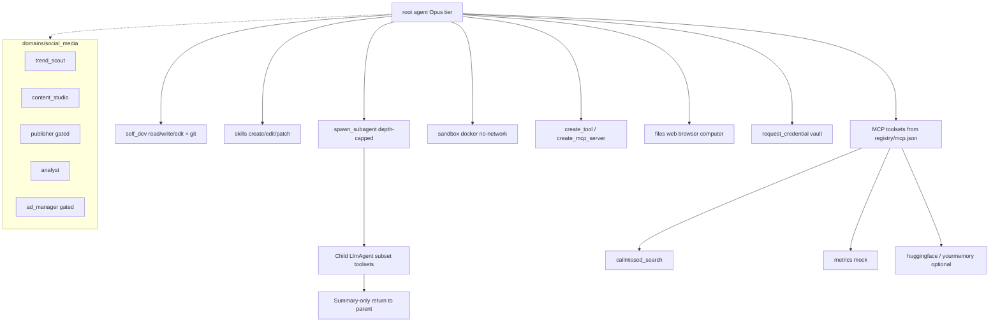
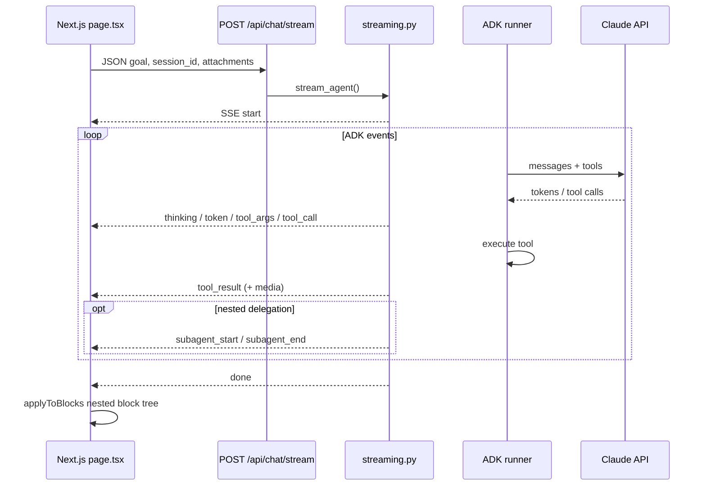
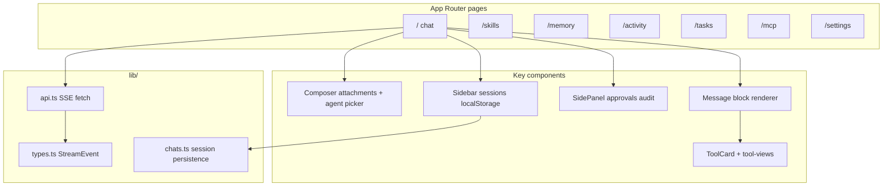
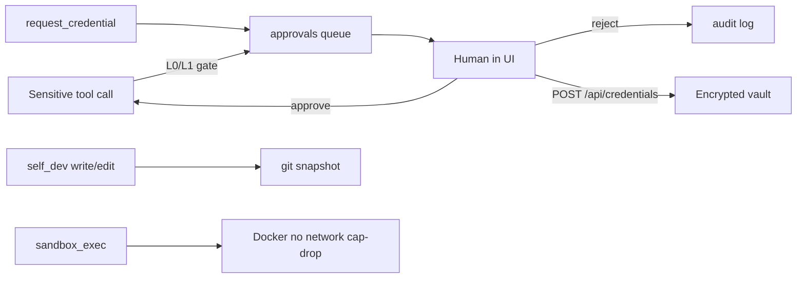
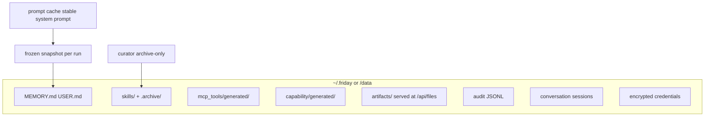

# Friday (hack-agent) — System Architecture

Friday is a **self-modifying autonomous agent** with a Cursor-style control plane: a Next.js chat UI, a FastAPI backend, Google ADK agent runtime, MCP tool servers, and human approval gates for sensitive actions.

---

## 1. System context

---

## 2. Deployment topology (production)

Single-host Docker Compose with Caddy TLS termination. The browser talks to one origin; routing splits API vs UI.

| Path | Target | Purpose |
|------|--------|---------|
| `https://<host>/api/*` | `backend:8080` | REST, SSE streams, static artifacts |
| `https://<host>/*` | `web:3000` | React chat UI (proxies API in dev via `next.config.js`) |

Local dev: `python -m cli serve` on `:8080`, `npm run dev` on `:3000` with API rewrite to backend.

---

## 3. Repository layout

---

## 4. Control plane (backend)

FastAPI app (`friday/control_plane/app.py`) is the single HTTP surface for UI, CLI, and automations.

### Key API surfaces (UI-facing)

| Endpoint | Role |
|----------|------|
| `POST /api/chat/stream` | Root agent chat (SSE) |
| `POST /api/agent/stream` | Named specialist agents |
| `GET/POST /api/approvals` | Human-in-the-loop queue |
| `GET /api/audit` | Structured activity log |
| `GET/POST/PUT/DELETE /api/skills` | Procedural memory (SKILL.md) |
| `GET /api/memory` | MEMORY.md + USER.md snapshot |
| `GET/POST /api/mcp` | MCP server registry |
| `POST /api/credentials` | Vault writes (never echoed to model) |
| `GET/POST /api/tasks` | Background task queue |
| `GET/POST /api/config` | Thinking, autonomy L0–L3, model display |
| `GET /api/files/*` | Read-only artifact hosting |

Optional `FRIDAY_API_TOKEN` → Bearer auth on all `/api/*` except health.

---

## 5. Agent runtime & tool model

Agents are declared in `registry/agents.json` and built by `control_plane/builder.py`.

**Model routing** (`core/model.py`): `classify_difficulty()` picks **hard** (Opus) vs **easy** (Sonnet) via LiteLlm against an Anthropic-compatible `/v1/messages` endpoint.

**Hot reload**: `builder.hot_reload()` bumps tool generation counter after self-edits, new tools, or MCP registration.

---

## 6. Streaming pipeline (chat UX)

The frontend contract is defined in `control_plane/streaming.py` and mirrored in `web/src/lib/types.ts`.

**UI block model**: assistant turns are ordered `Block[]` — text, thinking, tool cards, nested sub-agents, compaction markers. Events with `depth ≥ 1` route into the deepest open sub-agent container.

---

## 7. Frontend architecture

- **Session storage**: chat history in `localStorage` (`friday.chats.v1`); backend continuity via `session_id`.
- **API client**: `streamChat()` parses SSE over `fetch` + `ReadableStream` (POST body).
- **Icons**: custom transparent SVG set in `web/src/components/icons/`.

---

## 8. Security & approvals

| Autonomy | Behavior |
|----------|----------|
| L0 | Ask everything sensitive |
| L1 | Balanced — publish, self-edit, spend gated |
| L2 | Whitelisted actions auto-approve; sensitive actions still gated |
| L3 | Full auto — no approval queue (single-user locked hosts only) |

Secrets are scrubbed from audit logs; vault values never enter model context.

---

## 9. Data & memory

**Curator**: archive-only lifecycle for agent-created skills (never pinned user skills).

**Compaction**: long conversations summarized; UI shows `compaction` SSE events.

---

## 10. CLI & operations

| Command | Purpose |
|---------|---------|
| `python -m cli serve` | Uvicorn → `control_plane.app` |
| `python -m cli run "goal"` | One-shot root agent |
| `python -m cli social` | Social-media domain loop |
| `python -m cli eval` | Eval harness |
| `python -m cli curator` | Run skill curator |

CI: `.github/workflows/ci.yml` (backend tests + web build). Deploy: `.github/workflows/deploy.yml` + `docker-compose.yml`.

---

## Related docs

- Backend detail: `friday/architecture.md`
- Agent workflow: `AGENTS.md`
- SSE contract: `friday/control_plane/streaming.py` ↔ `web/src/lib/types.ts`
